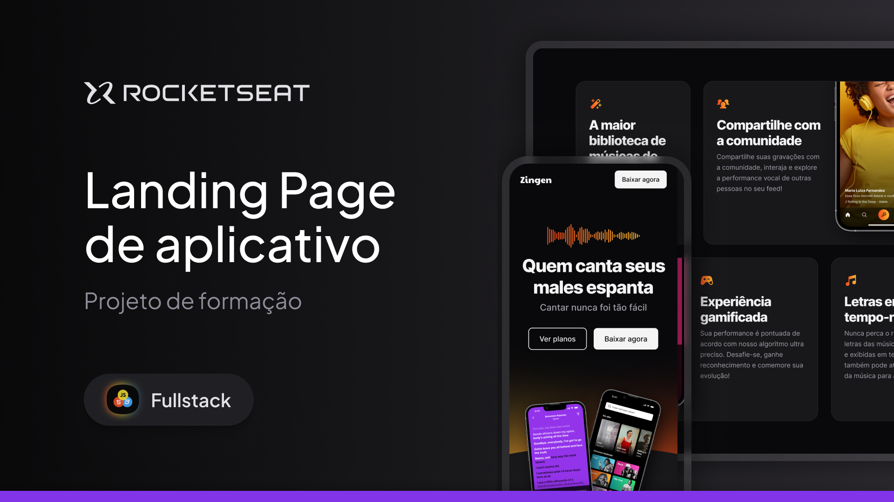

  

Projeto de uma landing page de produto desenvolvido durante as aulas sobre Responsividade na Rocketseat.

  <a href="#-tecnologias">Tecnologias</a>&nbsp;&nbsp;&nbsp;|&nbsp;&nbsp;&nbsp;
  <a href="#-projeto">Projeto</a>&nbsp;&nbsp;&nbsp;|&nbsp;&nbsp;&nbsp;
  <a href="#memo-licença">Licença</a>

  

 

  

## 🚀 Tecnologias

Esse projeto foi desenvolvido com as seguintes tecnologias:

- HTML
- CSS

## Projeto

- [Visita o projeto online!](https://molimpion.github.io/LP-De-Produtos/)

## Layout

Você pode visualizar o layout do projeto através [DESTE LINK](https://www.figma.com/design/NqsQoy9b29S0mSFnUQxkCI/LP-de-produto--Community-?node-id=0-1&p=f&t=Rq9pC5gaHHHSjGeL-0). É necessário ter conta no [Figma](https://figma.com) para abriacessá-lo.

## Licença

Esse projeto está sob a licença MIT.
